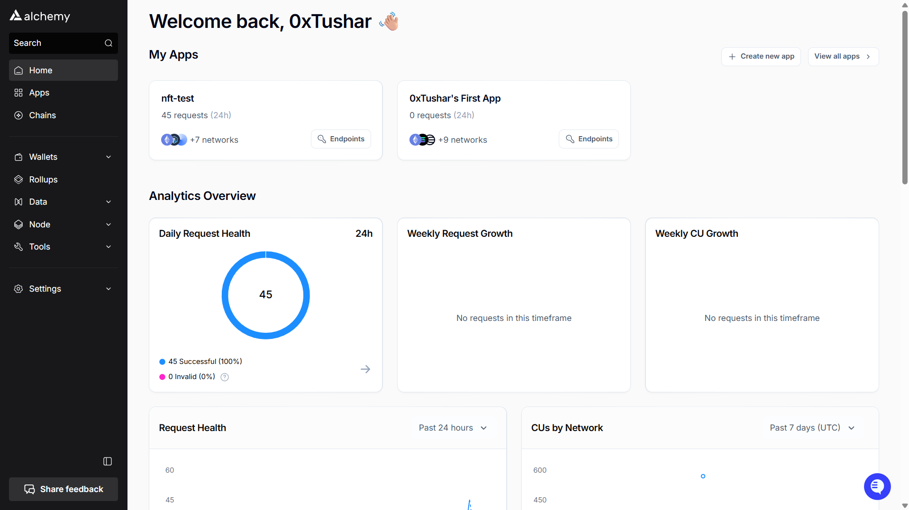
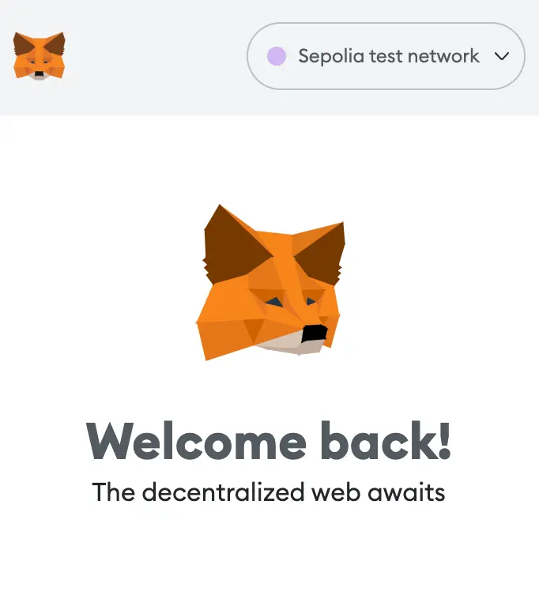
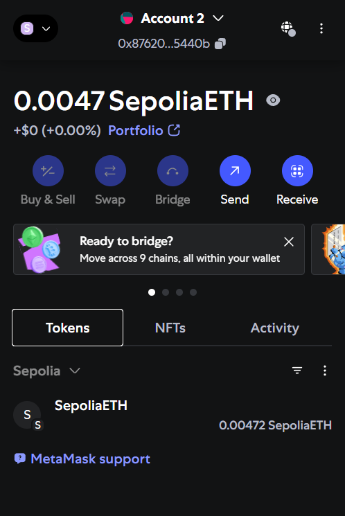
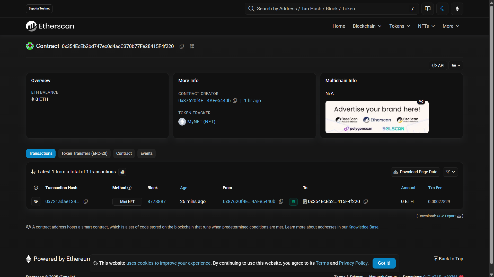

## Creating an NFT

### Prerequisites

Before you begin the steps in this tutorial, ensure you complete the following steps:

* Install both [Node.js](https://nodejs.org/en/) (> 14) and [npm](https://www.npmjs.com/) on your local machine. To check your Node version, run the following command in your terminal:


  ```shell shell
  node -v
  ```


* [Create a free Alchemy account.](https://alchemy.com/?r=affiliate:68212b46-a5c5-4f4c-bc8b-73f50536fcaf)

### Step 1: Create an Alchemy App

To create an Alchemy app, check out [this video](https://www.youtube.com/watch?v=tfggWxfG9o0) or follow the instructions below:

1. From [Alchemy's dashboard](https://dashboard.alchemy.com/signup), hover over the **Apps** drop-down menu and choose **Create App**.
2. Provide a **Name** and **Description** for your app.
3. For **Chain**, select **Ethereum** and for **Network** select **Sepolia**.
4. Click the **Create App** button.



Once you have created your app, click on your app's **View Key** button in the dashboard and save the **API KEY**. We will use this later.

### Step 2: Create a Metamask Wallet

We need an Ethereum wallet to send and receive transactions. For this tutorial, we’ll use Metamask, a virtual wallet in the browser. If you want to understand more about how transactions on Ethereum work, check out [this page](https://ethereum.org/en/developers/docs/transactions/) from the Ethereum foundation.

You can download and create a Metamask account for free [here](https://metamask.io/download/). Once you have an account, make sure to switch to the "Sepolia Test Network” in the upper right (so that we’re not dealing with real money).



### Step 3: Add SepoliaETH from a Faucet

In order to deploy our smart contract to the test network, we’ll need some fake SepoliaETH. The easiest way to acquire this is by using Alchemy's [Sepolia faucet](https://sepoliafaucet.com/). Depending on traffic, the faucet may ask you to sign in with your Alchemy account.

If all goes well, you should see your SepoliaETH balance updated on Metamask.



### Step 4: Create a Node Project

Let's create an empty node project. Navigate to your [command line](https://www.computerhope.com/jargon/c/commandi.htm) and type:


  ```shell shell
  mkdir my-nft && cd my-nft
  npm init -y
  ```


We are now in a good position to set up and install Hardhat, the industry standard Ethereum development environment.

### Step 5: Create a [Hardhat](https://hardhat.org/getting-started/#overview) Project

Hardhat is a development environment to compile, deploy, test, and debug smart contracts. It helps developers create dApps locally before deploying them to a live chain.

In your terminal, run the following commands:


  ```shell shell
  npm install --save-dev hardhat
  npx hardhat
  ```


You should then see a welcome message and options on what you can do. Select `Create a JavaScript project`:


  ```sql sql
  888    888                      888 888               888
  888    888                      888 888               888
  888    888                      888 888               888
  8888888888  8888b.  888d888 .d88888 88888b.   8888b.  888888
  888    888     "88b 888P"  d88" 888 888 "88b     "88b 888
  888    888 .d888888 888    888  888 888  888 .d888888 888
  888    888 888  888 888    Y88b 888 888  888 888  888 Y88b.
  888    888 "Y888888 888     "Y88888 888  888 "Y888888  "Y888

  👷 Welcome to Hardhat v2.12.2 👷‍

  ? What do you want to do? … 
  ❯ Create a JavaScript project
    Create a TypeScript project
    Create an empty hardhat.config.js
    Quit
  ```


Agree to all the defaults (project root, adding a `.gitignore`, and installing all sample project dependencies).

To check if everything works properly, run:


  ```shell shell
  npx hardhat test
  ```


We now have our hardhat development environment successfully configured. Let us now install the OpenZeppelin contracts package. This will give us access to ERC721 implementations (the standard for NFTs) on top of which we will build our contract.


  ```shell shell
  npm install @openzeppelin/contracts
  ```


### Step 6: Install dotenv

Install the dotenv package to manage environment variables:


  ```shell shell
  npm install dotenv --save
  ```


### Step 7: Uninstall the current ethers library

Uninstall any existing ethers library to avoid conflicts:


  ```shell shell
  npm uninstall ethers --legacy-peer-deps
  ```


### Step 8: Install ethers version 5 and Hardhat Ethers plugin

Install ethers version 5 along with the correct Hardhat Ethers plugin:


  ```shell shell
  npm install ethers@5 @nomiclabs/hardhat-ethers --legacy-peer-deps
  ```


### Step 9: Write the Smart Contract

Open the project in your favorite editor (e.g. [VSCode](https://code.visualstudio.com)). We will use a language called Solidity to write our contract.

Navigate to the `contracts` folder and create a new file called `MyNFT.sol`. Add the following code to the file.


  ```solidity solidity
  // SPDX-License-Identifier: MIT
  pragma solidity ^0.8.20;

  import "@openzeppelin/contracts/token/ERC721/extensions/ERC721URIStorage.sol";
  import "@openzeppelin/contracts/access/Ownable.sol";

  contract MyNFT is ERC721URIStorage, Ownable {
      uint256 private _tokenIds;

      constructor(address initialOwner) ERC721("MyNFT", "NFT") Ownable(initialOwner) {}

      function mintNFT(address recipient, string memory tokenURI)
          public
          onlyOwner
          returns (uint256)
      {
          _tokenIds++;

          uint256 newItemId = _tokenIds;
          _mint(recipient, newItemId);
          _setTokenURI(newItemId, tokenURI);

          return newItemId;
      }
  }
  ```


Make sure that the version defined above (`^0.8.20`) is the same as the version defined in the `hardhat.config.js` file. Now, let's break down the code line by line.

In lines 5-6, our code inherits two [OpenZeppelin](https://openzeppelin.com) smart contract classes:

* `@openzeppelin/contracts/token/ERC721/extensions/ERC721URIStorage.sol` contains the implementation of the ERC721 standard, which our NFT smart contract will inherit. (To be a valid NFT, your smart contract must implement all the methods of the ERC721 standard.) To learn more about the inherited ERC721 functions, check out the interface definition [here](https://eips.ethereum.org/EIPS/eip-721).
* `@openzeppelin/contracts/access/Ownable.sol` sets up [access control](https://docs.openzeppelin.com/contracts/3.x/access-control) on our smart contract, so only the owner of the smart contract (you) can mint NFTs.

Note, including access control is entirely a preference. If you'd like anyone to be able to mint an NFT using your smart contract, remove the word `Ownable` on line 6 and `onlyOwner` on line 14.

In lines 8-21, we have our custom NFT smart contract, which is surprisingly short — it only contains a counter, a constructor, and a single function! This is thanks to our inherited OpenZeppelin contracts, which implement most of the methods we need to create an NFT, such as `ownerOf` (returns the owner of the NFT) and `transferFrom` (transfers ownership of the NFT).

On line 10, you'll notice we pass two strings, "MyNFT" and "NFT" into the ERC721 constructor. The first variable is the smart contract's name, and the second is its symbol. You can name each of these variables whatever you wish!

Finally, starting on line 12, we have our function `mintNFT()` that allows us to mint an NFT! You'll notice this function takes in two variables:

* `address recipient` specifies the address that will receive your freshly minted NFT.
* `string memory tokenURI` is a string that should resolve to a JSON document that describes the NFT's metadata. An NFT's metadata is really what brings it to life, allowing it to have additional properties, such as a name, description, image, and other attributes. In part 2 of this tutorial, we will describe how to configure this metadata.

`mintNFT` calls some methods from the inherited ERC721 library, and ultimately returns a number that represents the ID of the freshly minted NFT.

### Step 10: Connect Metamask & Alchemy to Your Project

Now that we've created a Metamask wallet, an Alchemy account, and a smart contract, it’s time to connect the three.

Every transaction sent from your virtual wallet requires a signature using your unique private key. To provide our program with this permission, we can safely store our private key (and Alchemy API key) in an environment file.

Create a `.env` file in the root directory of our project, and add your Metamask private key and HTTP Alchemy API Key (from Step 1) to it.

<Warning>
  Your `.env` file must be named `.env`! Do not change the name to `xx.env`.
</Warning>

Follow [these instructions](https://metamask.zendesk.com/hc/en-us/articles/360015289632-How-to-Export-an-Account-Private-Key) to export your private key from Metamask.

Your `.env` should look like this:


  ```shell shell
  API_URL = "https://eth-sepolia.g.alchemy.com/v2/your-api-key"
  PRIVATE_KEY = "your-metamask-private-key"
  ```


Remember to replace `your-api-key` with your actual Alchemy API key that you can get from your [Alchemy dashboard](https://dashboard.alchemy.com/signup).

### Step 11: Update `hardhat.config.js`

We’ve added several dependencies and plugins so far, now we need to update `hardhat.config.js` so that our project knows about all of them.

Replace the contents of `hardhat.config.js` with the following:


  ```javascript javascript
  require("dotenv").config();
  require("@nomiclabs/hardhat-ethers"); // Ensure this is the correct package
  const { API_URL, PRIVATE_KEY } = process.env;

  module.exports = {
    solidity: {
      compilers: [
        {
          version: "0.8.24",
          settings: {
            optimizer: {
              enabled: true,
              runs: 200,
            },
          },
        },
        {
          version: "0.8.20",
          settings: {
            optimizer: {
              enabled: true,
              runs: 200,
            },
          },
        },
      ],
    },
    defaultNetwork: "sepolia",
    networks: {
      hardhat: {},
      sepolia: {
        url: API_URL,
        accounts: [`0x${PRIVATE_KEY}`],
      },
    },
  };
  ```


### Step 12: Write the Deployment Script

Now that our contract is written and our configuration file is good to go, it’s time to write the contract deploy script.

Create a directory called `scripts/` at the root of the project and add a `deploy.js` file to it with the following:


  ```javascript javascript
  async function main() {
     const [deployer] = await ethers.getSigners();
     
     // Grab the contract factory 
     const MyNFT = await ethers.getContractFactory("MyNFT");

     // Start deployment, returning a promise that resolves to a contract object
     const myNFT = await MyNFT.deploy(deployer.address); // Pass the deployer's address as the initial owner
     
     await myNFT.deployed();

     console.log("Contract deployed to address:", myNFT.address);
  }

  main()
    .then(() => process.exit(0))
    .catch(error => {
      console.error(error);
      process.exit(1);
    });
  ```


### Step 13: Deploy the Contract

We’re finally ready to deploy our smart contract! Navigate back to the root of your project directory, and in the command line run:


  ```shell shell
  npx hardhat run scripts/deploy.js --network sepolia
  ```


You should then see something like:


  ```text text
  Contract deployed to address: 0x354EcEb2bd747ec0d4acC370b77Fe28415F4f220
  ```


If we go to [Sepolia Etherscan](https://sepolia.etherscan.io/) and search for our contract address we should be able to see that it has been deployed successfully. The transaction will look something like this:



The `From` address should match your Metamask account address and the To address will say *Contract Creation*. If we click into the transaction, we’ll see our contract address in the *To* field:


Yasssss! You just deployed your NFT smart contract to the Ethereum chain 🎉

To understand what’s going on under the hood, let’s navigate to the Logs tab in our [Alchemy dashboard](https://dashboard.alchemy.com/logs). If you have multiple Alchemy apps make sure to filter by app and select “MyNFT”.


Here you’ll see a handful of JSON-RPC calls that Hardhat/Ethers made under the hood for us when we called the `.deploy()` function.

Two important ones to call out here are [`eth_sendRawTransaction`](https://docs.alchemyapi.com/alchemy/documentation/alchemy-api-reference/json-rpc#eth_sendrawtransaction), which is the request to actually write our smart contract onto the Sepolia chain, and [`eth_getTransactionByHash`](https://docs.alchemyapi.com/alchemy/documentation/alchemy-api-reference/json-rpc#eth_gettransactionbyhash) which is a request to read information about our transaction given the hash (a typical pattern when sending transactions).
